# Music Mood Lifter

#### Introduction

The Music Mood Lifter is a software system empowered by machine learning algorithms that can detect facial expressions from input faces. Based on the predicted mood, the system can list out appropriate songs for users to choose from. The inputs are images uploaded by users, and the outputs have the Spotify links that will direct users to the recommended songs. This application will be implemented through a webpage. Xception is used as the base model for recognizing facial emotion, and a handwritten multiclass neural network will be used to classify songs by moods.

#### Project Overview

- Datasets were collected to train the face emotion model and music mood classifier model 
- The face emotion model and music mood model were written and trained by the datasets
- OpenCV function was created to process input images and a Music list classified by moods was created to be later used by the music recommender 
- A music recommending system was created 
- Django project was created to develop a web application that deploys our ML and related functions

#### Project Schematic

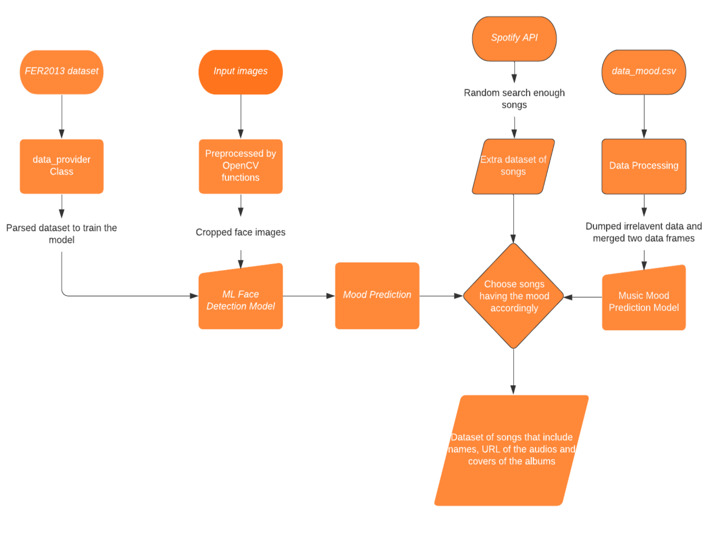

Figure1. Project components

#### Components of the Project

#### Dataset Collection

**FER2013 dataset**

For the facial detection task, the FER2013 dataset was collected from Kaggle which consists of 48x48 pixel well-centered grayscale face images. There are 7 categories in total (0=Angry, 1=Disgust, 2=Fear, 3=Happy, 4=Sad, 5=Surprise, 6=Neutral).

**Data Provider**

A data provider class was written to process input data retrieved from the FER2013 to produce a processed dataset that was made compatible with the model. In this algorithm, Panda API was used to extract the CSV from the fer2019 emotion classification dataset. By employing Numpy API, the data in the “pixels” column were reshaped as 2D arrays. With the help of OpenCV API, arrays were resized to size=(48, 48). Numpy’s expand function enabled us to decrease the dims of the 2D array back to 1D. The arrays were then normalized to have a range of [-1,1] that ensure pixels have similar data distribution, which contributes to faster convergence during model training. and Panda API’s get_dummies function helped retrieve the label of the dataset (happy, angry, .ex) from the “emotion” column. Thus, by using functions created in the data provider class, images were converted to a shape of (64, 64, 1) that can be later fed into our model.

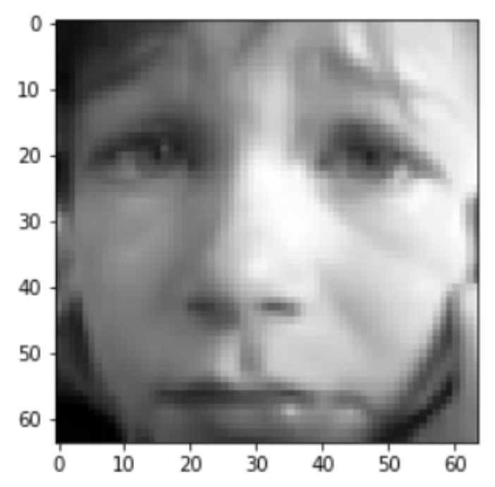

Figure2. Resized dataset (64, 64)

With the newly parsed datasets containing both labels and data, we had also split the sets into training and testing datasets.

❏ Music Mood Prediction Component

**Data_moods.csv**

A labeled dataset with the size of 686 was collected from previous research about predicting the music mood of a song with deep learning. It has 19 columns including name, album, artist, id, release_date, popularity, length, danceability, acousticness, energy, instrumentalness, liveness, valence, loudness, speechness, tempo, key, time_signature, and mood [5]. The metadata and the features of the songs were retrieved using Spotipy, an API of Spotify in python [8]. And the moods of the song were classified manually by the author of the former research [6]. The moods were in four categories, (0=calm, 1=happy, 2=energetic, 3=sad). In most existing methods of music mood classification, the moods of songs are divided according to psychologist Robert Thayer’s traditional model of mood. The model divides songs along the lines of energy and stress, from happy to sad and calm to energetic, respectively [10].

**Data Processing**

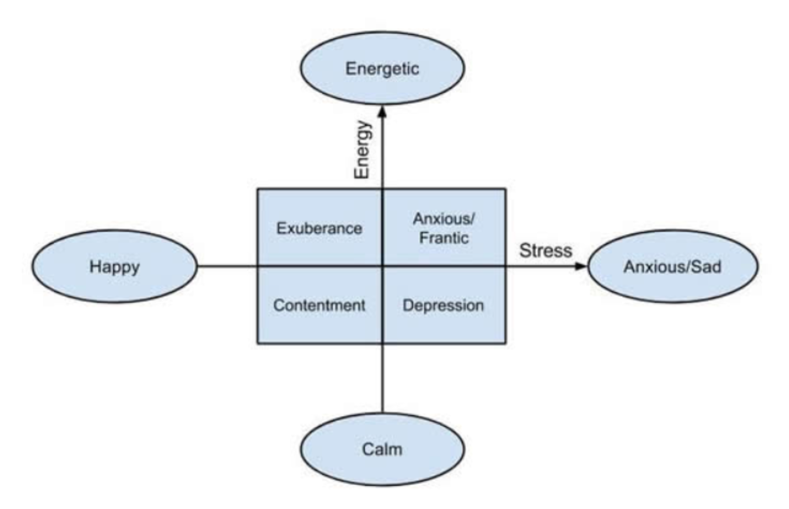

Figure3. Classification of music by moods

After retrieving the data, we need to clean the data. First, we dropped some columns of the excessive data including the type, key, mode, and time signature. Then, we imported train_test_split from sklearn.model_selection to help with the process of splitting the dataset into training and testing sets. We decided it would be efficient if we had individual sets for the mood as well as the features (training 80% testing 20%). When splitting the dataset into its training and testing portions, we used the MinMaxScaler from sklearn.preprocessing to scale the values between a range of [0,1] and preserving the shape of the original distribution. The MinMaxScaler will initially fit data and then subsequently transform it. Finally, we used the label_encode from sklearn.preprocessing to encode the labels.

**Extra Spotify Music Data Retrieving**

Since we need to recommend songs to our users, we need to retrieve more songs according to the moods classified by the face model. We used the same Spotify API to retrieve data as the former researcher [9]. We created two functions to get the tracks and the features corresponding to the tracks that we just got. Besides, we created a random search method that would generate characters randomly and the getTracks of Spotify would search by relevance and would return audios according to popularity.

Models

❏ Face Detection Component 

**Base Model**

To classify emotions from human faces, Xception was adapted and was modified to fit our dataset rather than the Resnet model suggested in the proposal. The reason we chose to use Xception as our base model is that it is not as deep as the Resnet model in terms of layers, but it focuses more on improving computational efficiency with a shallower network while obtaining high accuracy[1]. The ResNet model is built to hold a deep neural network that focuses on accuracy. However, as the network goes deeper, the computational efficiency decreases. Since we have limited computational power and time. Thus, we have shifted our priority to a faster and reasonably accurate model. Moreover, the deeper networks might produce worse outcomes than shallower networks because it is more difficult to optimize in deeper layers and sometimes produce worse accuracy due to overfitting on smaller datasets like ours[2]. On the other hand, the Xception model is an extension of the inception model that focuses on reducing computational cost by computing several transformations over the same input map in parallel[3]. This model is faster and more accurate to train smaller datasets. For our dataset, we have small images (48x48) thus the size of the dataset is comparatively small. If we use the higher-accuracy and deeply layered ResNet model on our dataset, it could cause huge overfitting that would decrease the validation accuracy. Therefore, we decided to use Xception as our base model. Xception uses depth-wise separable convolutions to reduce the computational complexity in each convolutional layer allowing the network to run faster in CPU operation[3]. However, we changed these convolutions to the normal 2d convolutions to achieve better accuracy. We also dropped the middle flow out of the original model to avoid large overfitting on our small images and to maintain high computational efficiency. Thus, we only kept the entry flow and the exit flow. The model consists of a base module and comes with 4 depth-wise convolutions. Every depth-wise convolution is coupled by two convolutions and a max-pooling function, and each convolution is followed by a batch normalization operation and a ReLU activation function. The final layer uses a global average pooling and a soft-max activation function to make predictions.

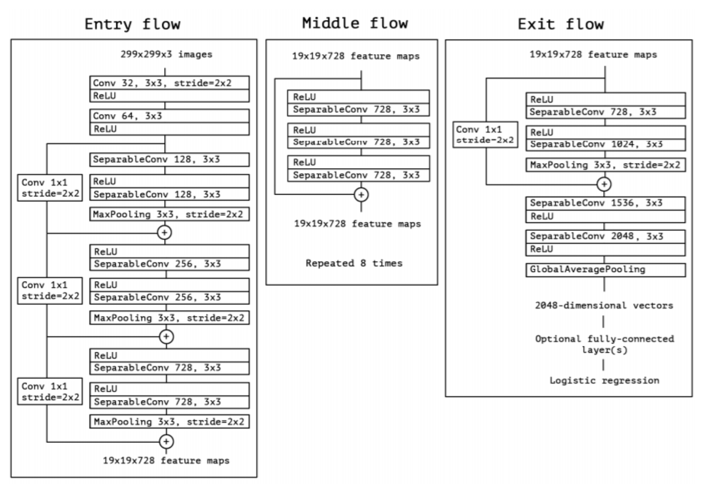

Figure4. A flow chart of the Xception model

**Training and Testing**

After completing the model, we fed the parameters: image shape (64,64,1) and the number of output classes( ‘angry’, ‘disgust’, ‘fear’, ‘happy’, ‘sad’, ‘surprise’, ‘neutral’) into the model and compiled it with Adam as our optimizer function, and Categorical_corssentropy as our loss function. We used ImageDataGenerator from Keras library that takes in the datasets to generate batches of the augmented data (size=32). To better normalize our dataset, Rotation_range, shift_ranges, shear_range, and horizontal_flip were also applied to maintain the consistency of the input images. We used the fit function on the model to regulate the parameters like batch size, epochs, steps per epoch. We also applied ReduceLROnPlateau and EarlyStopping to better optimize our settings for higher accuracy as we went deeper into the epochs.

**Results**

After several attempts to run the model with different adjustments to the parameters, we came close to a validation accuracy of around 69%.

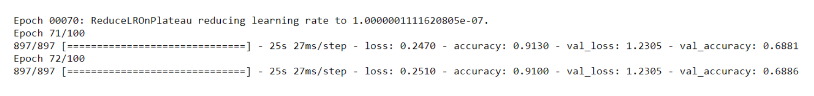

Figure 5. Results from our adjusted Xception model

We have also tried using L2 Regularization to improve the overfitting between val_accuracy and train_accuracy. However, there was no improvement at all, and we ended up with a val_accuracy of around 68%.

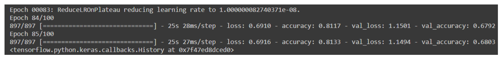

Figure6. Results from our Xception model with L2 Regularization

We also tried using a deeper model, ResNet50, which failed miserably with around 25% validation accuracy. This validates our claims on switching to the Xception model with higher accuracy than the ResNet model.

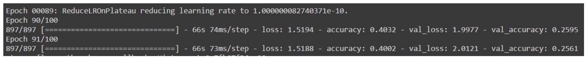

Figure7. Results from using the ResNet50 model

Since we retrieved the FER2013 dataset from Kaggle, we have also looked at the leaderboard of this challenge [4]. And we observed that the first place has a validation accuracy of 71%, 69% for the second place, and 68% for the third place, which we came very close to. Overall I think we did a pretty good job on the face detection ML Classifier component.

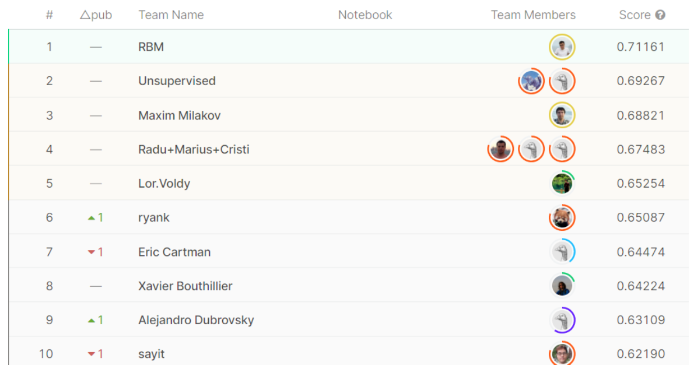

Figure8. Leaderboard of the face detection challenge on fer2013 dataset [4]

❏ Music Mood Prediction Component 

**Base Model**

For the model of music moods prediction, we first did a few experiments. We built a deep neural network ourselves and tried to use gradient booster. But the accuracy turned out to be at most around 50% which was not satisfying. Therefore, we decided to exploit a former resarcher’s Multiclass Neural Network with an input of 9 Features, 1 Layer with 8 nodes, and 4 outputs with the output Layer. The activation Function corresponds to a Rectified Linear Unit (Relu), the Loss function is a Logistic Function and Adam Gradient Descent Algorithm is the optimizer. To evaluate the model, we used KerasClassifier and it turned out to be around 80% for the average performance.

Figure9. Results from using the KerasClassifier

The original author used the KerasClassifier as the estimator to train the data. However, the model on a KerasClassifier was not able to save, which enormously slowed the process of recommending the songs after we put everything on the server. Therefore, we just simply trained the model again and successfully saved the model to improve the performance.

**Training and Testing**

After evaluating the model, we transformed the labels to one-hot code labels and trained the model with batch size equal to 64 and 300 epochs. We have an accuracy of 82% for the best case.

Figure10. Results from training the model using the multiclass neural network

**Results**

A model with a performance of at most 82% is accurate enough to classify songs for our needs.

● Non-Machine Learning Components (Web-development)

As the interface for users to use our system, we had proposed three alternative plans labeled below to implement the non-ML part of the system. To create a prototype product we had discussed their pros and cons and considered one feasible alternative to implement an application.

**Project alternatives:**

1. WebApplication
2. PC programs (Locally computing)
3. Mobile Applications (Locally computing)

Our team proposed to design a website and make it as an interface of this recommender system. The computation and data occurs and is processed on the remote server. This is the major difference between the other alternatives. Since the terminal devices the user have may have limited performance to run the machine-learning program and considering the using experience, we had decided to move the computation to the remote server. Therefore, we can control the real user experience by accessing the server as a real user, this makes the debugging process easier.

This system is running on the virtual machine held by Google Cloud Platform, and the IP is resolved to the domain: http://cpen291.yslalan.xyz by the DNS provider, Tencent Cloud.

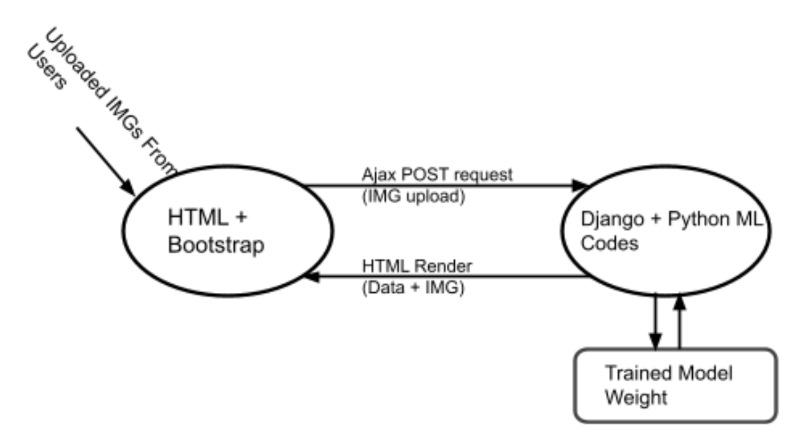

Figure11. Web application structure

To implement this function we decided to use HTML, javascript to support our front-end web development. The code has been deeply associated with the back-end framework (Django framework). As the user activates the function of uploading images to the server, the front-end system calls the back-end system and initializes a POST request to send a file to the backend. In this system, the ajax library has been applied to the system to build this bridge connecting the front-end and back-end system. This relationship has been labeled in the diagram above.

For the back-end of the application, we considered three ways to do it.

**Web back-end framework alternatives:**

1. Docker backend
2. Flask framework
3. Django framework

After searching materials, we found the Django web framework is enough for our app and there are lots of tutorials so that it could be easy to start. We referred to the official docs of Django on how to run web development on the Django web framework. This is a Python-based framework, therefore the ML codes can be embedded directly to the back-end codes [7]. Additionally, the trained model weight has been saved locally to the server to increase the speed of processing the request by the users. The results returned from the ML part are rendered to the HTML webpage through the embedded functions of the Django framework.
 We designed two web pages for this system, one is the home page for uploading the image from users’ local disk, and the other is the web page for showing the detected emotion and recommended music. As users select one image from their PC or mobile devices and click the button, “Process my image”, the web will jump to the second web page and show the result computed by the system. On this web page, the detected emotion, music name, the specific hyperlink to Spotify, and the album cover image will be displayed on this page. If users want to get more suggestions from our system, they can click the button “Refresh Page” at the page bottom to get the next recommended music according to the emotion detected from the image uploaded by the user. **Website Preview:** **http://cpen291.yslalan.xyz**

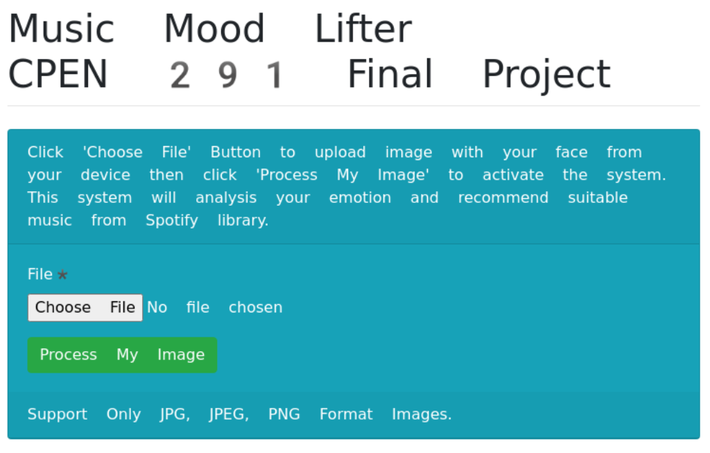

Figure12. Web Homepage

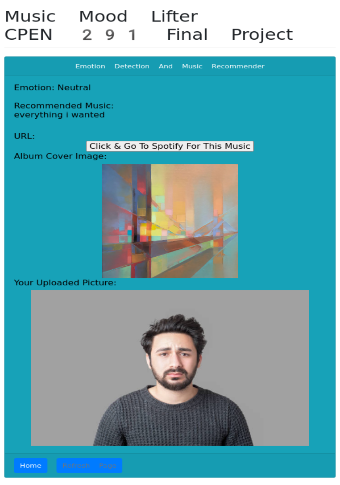

Figure13. Music recommendation page with music direction link to Spotify

##### Other Components

- ❏  **Generating Extra Songs**

  Since the prediction results of our model were tensors of possibilities of how much likely the moods of the songs could be, we had to take the argmax of the tensor to get which moods the songs were most likely to be. Then we decided to random search for 50 songs to get enough songs that must include songs with a typical mood. But after some testing, we found that there were so few energetic songs that we needed to search for around 500 songs to get enough energetic songs.

- ❏  **Recommender System**

  Our system recommends music corresponding to four different moods depending on the user’s detected facial emotion. The four moods we classified our music into include calm, happy, sad, and energetic. Additionally, our facial detection system categorizes the user’s emotion into one of 7 categories: angry, disgusted, fearful, happy, neutral, sad, and surprised. We decided to recommend the music that best fits the user’s current emotion, whether it is to provide relief or intensification. If the user is either angry, disgusted or fearful, calm music would be recommended in order to calm the user down from their emotional state. Additionally, we believe if the user is displaying a surprised reaction, they most likely will have pent-up energy and adrenaline, therefore, energetic music would pair well with their heightened state. Finally, if the user is happy or neutral, happy music would play and if the user is sad, sad music would play.

- ❏  **Processing the input images using OpenCV**

  After the model was trained to classify face emotions, we have developed a way to retrieve data for the model to predict the emotion from the input images. We developed a detect_face function for this task. In this function, OpenCV’s built-in cascade classifier called “haar” was used to obtain the coordinates of the box that enclosed the face detected in the image. Then, we used that coordination to crop the face part out from the picture by using cv2.rectangle and converted it into arrays that could be fed into the model. We also saved the structure of the model in a json file and the weight of the model in an h5 file, so when we want to use the model for prediction, we could just load the model back using Keras.model built-in function model_from_json.

**References**

[1] Fransiska, “The differences between Inception, ResNet, and MobileNet,” Medium, 22-Aug-2019. [Online]. Available: https://medium.com/@fransiska26/the-differences-between-inception-resnet-and-mobilenet-e97736a709b0. [Accessed: 16-May-2021].

[2] S. Vignesh, “The Perfect Fit for a DNN.,” *Medium*, 24-Jul-2020. [Online]. Available: https://medium.com/analytics-vidhya/the-perfect-fit-for-a-dnn-596954c9ea39. [Accessed: 16-May-2021].

[3] “An Intuitive Guide to Deep Network Architectures,” KDnuggets. [Online]. Available: https://www.kdnuggets.com/2017/08/intuitive-guide-deep-network-architectures.html/2#:~:text=Xception%20slightly%20outperforms%20Inception%20v3,implying%20a%20greater%20computational%20efficiency. [Accessed: 16-May-2021].

[4] “Challenges in Representation Learning: Facial Expression Recognition Challenge,” Kaggle. [Online]. Available: https://www.kaggle.com/c/challenges-in-representation-learning-facial-expression-recognition-challenge/leaderboard.[Accessed: 16-May-2021].

[5] C Veas. “Predicting the Music Mood of a Song with Deep Learning.” Towards Data Science. 2020. [Online]. Available: https://towardsdatascience.com/predicting-the-music-mood-of-a-song-with-deep-learning-c3ac2b45229e [Accessed: 16-May-2021].

[6] Cristobalvch. “Spotify-Machine-Learning.” [Online]. Available: https://github.com/cristobalvch/Spotify-Machine-Learning [Accessed: 16-May-2021].

[7] P Płoński. “Deploy Machine Learning Models with Django.” 2019. [Online]. Available: https://www.deploymachinelearning.com [Accessed: 16-May-2021].

[8] “Spotify Tracks API.” Web API Reference. 2021. [Online]. Available: https://developer.spotify.com/documentation/web-api/reference/#category-tracks [Accessed: 16-May-2021].

[9] M Garg. “Build Your Spotify Playlist Using Machine Learning.” Medium. 2020. [Online]. Available: https://medium.com/swlh/build-spotify-playlist-using-machine-learning-45352975d2ee [Accessed: 16-May-2021].

[10] M Nuzzolo. “Music Mood Classification”. [Online]. Available: https://sites.tufts.edu/eeseniordesignhandbook/2015/music-mood-classification/ [Accessed: 16-May-2021]